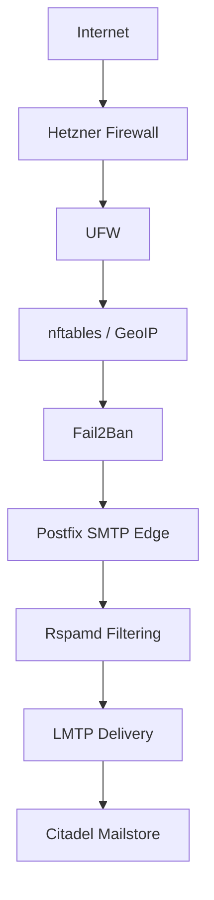
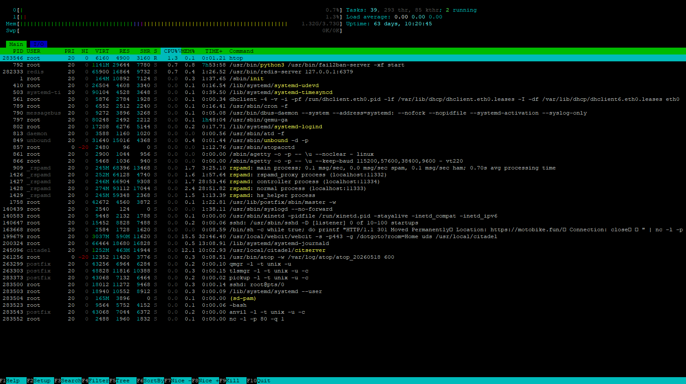

# Modern Citadel Mail Platform

Modern Citadel Mail Platform is a native Linux mail and collaboration stack based on Citadel Groupware, Postfix, LMTP and Rspamd.

This project demonstrates that modern, secure and scalable communication infrastructure can still be built using transparent Unix principles without container orchestration or cloud dependency.

---

# Philosophy

This project follows several core principles:

- native Linux services
- transparent architecture
- no Docker or Kubernetes
- low operational complexity
- modular mail flow
- efficient resource usage
- complete infrastructure ownership
- long-term maintainability

The goal is not nostalgia.

The goal is proving that classic Unix architecture can still provide modern and secure communication infrastructure.

---

# Core Technologies

## Mail Platform

- Citadel Groupware
- Postfix SMTP Edge
- LMTP local delivery
- Rspamd spam filtering
- DKIM / DMARC / ARC
- TLSA / DANE support

## Security

- nftables
- iptables
- UFW
- Fail2Ban
- WireGuard administration VPN

## Infrastructure

- native Debian Linux
- Hetzner CX22
- no containers
- no orchestration
- low resource footprint

---

# Architecture Overview

---

# Mail Flow

Incoming mail follows this path:

Internet → Postfix → Rspamd → LMTP → Citadel

This architecture separates:

- SMTP transport
- spam filtering
- queue management
- local delivery
- mailbox storage

into dedicated Unix services.

---

# Infrastructure

The current production system runs on:

- Hetzner CX22
- 2 vCPU
- 4 GB RAM
- 40 GB SSD

while maintaining very low CPU and memory utilization.

---

# Security Model

The platform uses layered security:

- provider firewall
- host firewall
- GeoIP filtering
- Fail2Ban jail segmentation
- WireGuard administration access
- SMTP relay restrictions
- modern TLS configuration
- DKIM / SPF / DMARC validation

---

# Why Native Linux?

This project intentionally avoids:

- Docker
- Kubernetes
- large orchestration frameworks
- opaque infrastructure abstraction

Advantages:

- lower RAM usage
- lower storage overhead
- transparent troubleshooting
- direct service visibility
- simpler maintenance
- educational value
- long-term reliability

---

# Documentation

## Core Documentation

- [Design Philosophy](docs/design-philosophy.md)
- [Mail Flow](docs/mail-flow.md)
- [Infrastructure](docs/infrastructure.md)
- [Performance](docs/performance.md)

## Security Documentation

- [Security Model](docs/security-model.md)
- [Security Stack](docs/security-stack.md)

## Mail Architecture

- [Postfix LMTP Migration](docs/postfix-lmtp-migration.md)

---

# Production Goals

The project demonstrates:

- modern mail security
- efficient native infrastructure
- low-resource production hosting
- transparent Unix service architecture
- container-free deployment
- self-hosted communication sovereignty

---

# Status

Production system running stable.

Features currently deployed:

- LMTP delivery
- Rspamd filtering
- ARC signing
- DKIM signing
- DMARC validation
- WireGuard administration
- GeoIP filtering
- multi-domain hosting
- queue-based reliability

---

# License

MIT License
