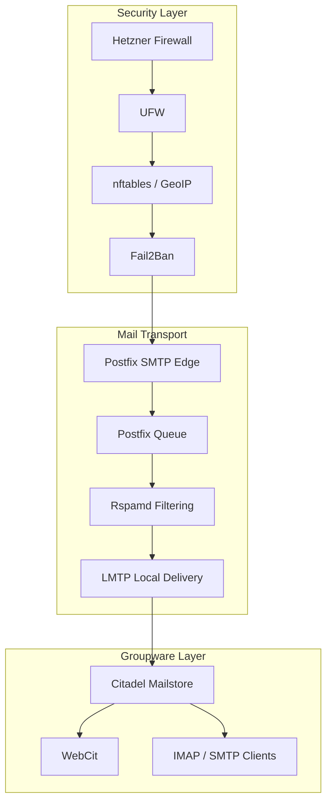
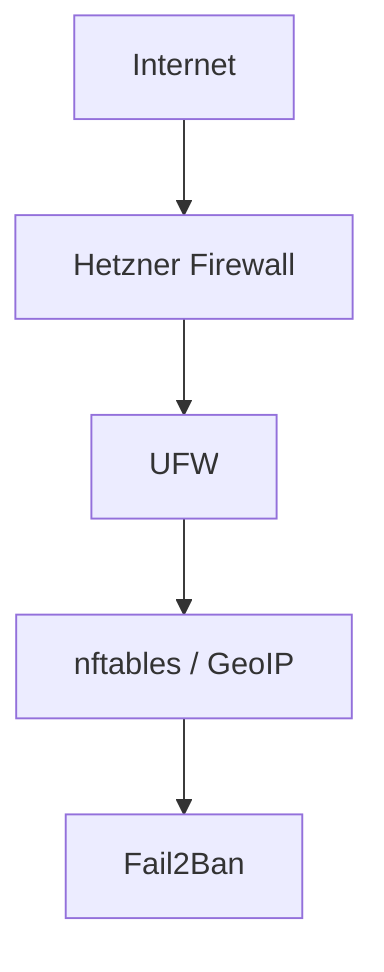
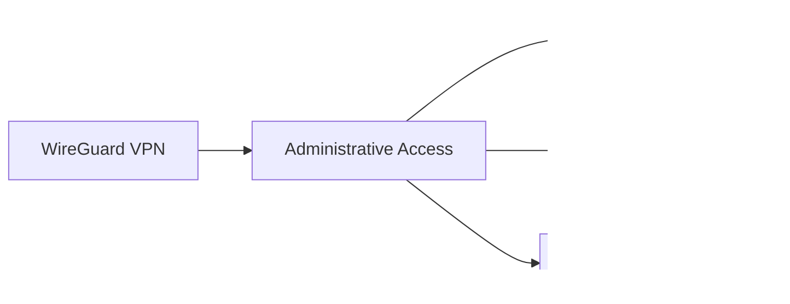
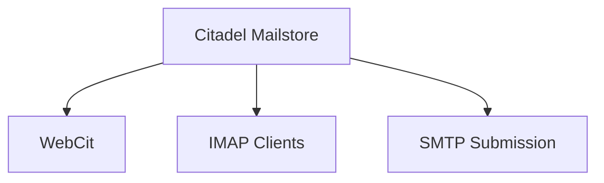

```mermaid
flowchart TD

subgraph Security Layer
A[Hetzner Firewall]
B[UFW]
C[nftables / GeoIP]
D[Fail2Ban]
end

subgraph Mail Transport
E[Postfix SMTP Edge]
F[Postfix Queue]
G[Rspamd Filtering]
H[LMTP Local Delivery]
end

subgraph Groupware Layer
I[Citadel Mailstore]
J[WebCit]
K[IMAP / SMTP Clients]
end

A --> B --> C --> D --> E
E --> F --> G --> H --> I

I --> J
I --> K
```

# Additional Architecture Diagrams

## Internet Entry Point

```mermaid
flowchart TD

X[Internet]
--> A[Hetzner Firewall]

A --> B[UFW]
B --> C[nftables / GeoIP]
C --> D[Fail2Ban]
```

---

## Administrative Access

```mermaid
flowchart LR

W[WireGuard VPN]
--> S[Administrative Access]

S --> P[SSH]
S --> R[Rspamd WebUI]
S --> C[Citadel Administration]
```

---

## Client Access Layer

```mermaid
flowchart TD

A[Citadel Mailstore]

A --> B[WebCit]
A --> C[IMAP Clients]
A --> D[SMTP Submission]
```
