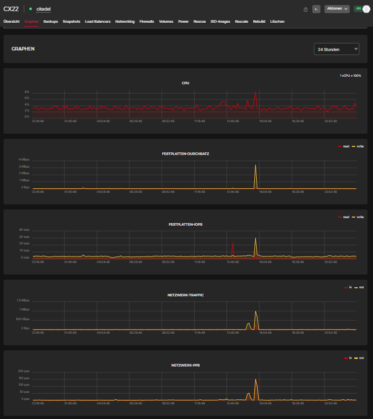

# Infrastructure

## Hosting Environment

The Modern Citadel Mail Platform currently runs on a small Hetzner CX22 virtual machine located in Finland.

Despite the limited hardware resources, the platform reliably operates:

- Citadel Groupware
- Postfix
- Rspamd
- Redis
- Fail2Ban
- WireGuard
- WebCit

using a fully native Linux deployment model.

---

# Infrastructure Overview

---

# Current Production Resources

- 2 vCPU
- 4 GB RAM
- 40 GB SSD
- low monthly operating cost
- low idle CPU utilization
- minimal storage overhead

---

# Infrastructure Philosophy

The platform intentionally avoids oversized cloud infrastructure and container orchestration systems.

Instead, the project focuses on:

- lightweight Unix services
- native package management
- transparent system administration
- long-term maintainability
- low operational complexity

This demonstrates that modern and secure communication infrastructure can still operate efficiently on small systems.
