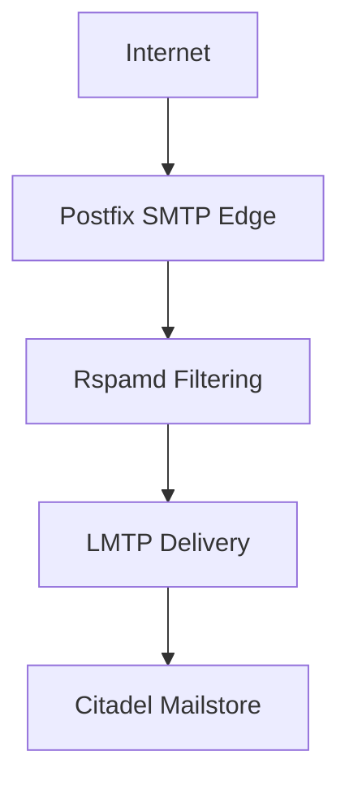
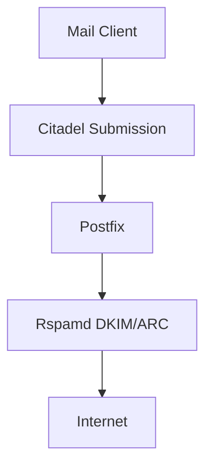

# Mail Flow

## Overview

The Modern Citadel Mail Platform uses a modular Unix-style mail architecture with clear separation of responsibilities.

Instead of combining all functionality into a monolithic application, the platform separates:

- SMTP transport
- spam filtering
- queue management
- local delivery
- mailbox storage

into specialized native Linux services.

This improves:

- maintainability
- transparency
- troubleshooting
- modularity
- operational reliability

---

# Inbound Mail Flow

Incoming mail follows this path:

---

## Postfix SMTP Edge

Postfix acts as the public SMTP entry point.

Responsibilities:

- inbound SMTP handling
- TLS encryption
- queue management
- retry handling
- relay restrictions
- protocol validation

Postfix intentionally operates as the external mail transport layer while Citadel focuses on mailbox and groupware functionality.

---

## Rspamd Filtering

Rspamd is integrated using Postfix milters.

Responsibilities:

- spam detection
- DKIM signing
- ARC signing
- DMARC evaluation
- DNSBL checks
- reputation analysis
- policy enforcement

Rspamd processes mail before final local delivery.

---

## LMTP Delivery

After filtering, Postfix delivers mail to Citadel using LMTP.

LMTP replaces the older SMTP-based local delivery previously used between Postfix and Citadel.

Advantages of LMTP:

- direct mailbox delivery
- cleaner local architecture
- reduced internal SMTP complexity
- proper local delivery semantics
- improved service separation

Citadel provides native LMTP sockets for local message injection.

---

## Citadel Mailstore

Citadel handles:

- mailbox storage
- IMAP access
- webmail
- groupware functionality
- collaboration features
- message indexing

Citadel acts as the final message destination within the platform.

---

# Outbound Mail Flow

Outgoing mail follows this path:

---

# Security Integration

The mail flow integrates multiple security layers:

- TLSv1.3
- SPF
- DKIM
- DMARC
- ARC
- DNSSEC
- DANE/TLSA
- Fail2Ban
- GeoIP filtering
- WireGuard restricted administration

This allows the platform to remain lightweight while still supporting modern mail security standards.

---

# Design Philosophy

The platform intentionally follows classic Unix principles:

- small specialized services
- clear separation of responsibilities
- transparent infrastructure
- native Linux integration
- minimal abstraction layers

The goal is not maximum complexity.

The goal is reliability, maintainability and operational transparency.
