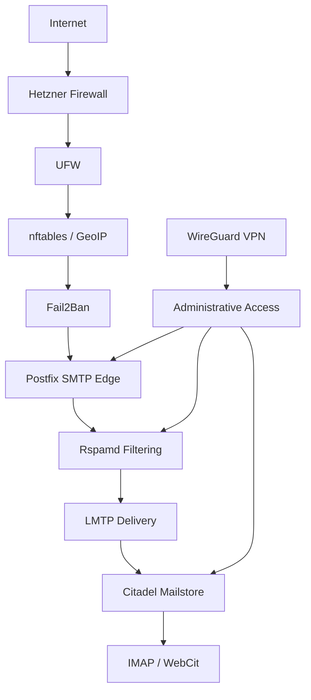

```mermaid
flowchart TD

A[Internet]
--> B[Hetzner Firewall]
--> C[UFW]
--> D[nftables / GeoIP]
--> E[Fail2Ban]

E --> F[Postfix SMTP Edge]

F --> G[Rspamd Filtering]

G --> H[LMTP Delivery]

H --> I[Citadel Mailstore]

I --> J[IMAP / WebCit]

K[WireGuard VPN]
--> L[Administrative Access]

L --> I
L --> G
L --> F
```
