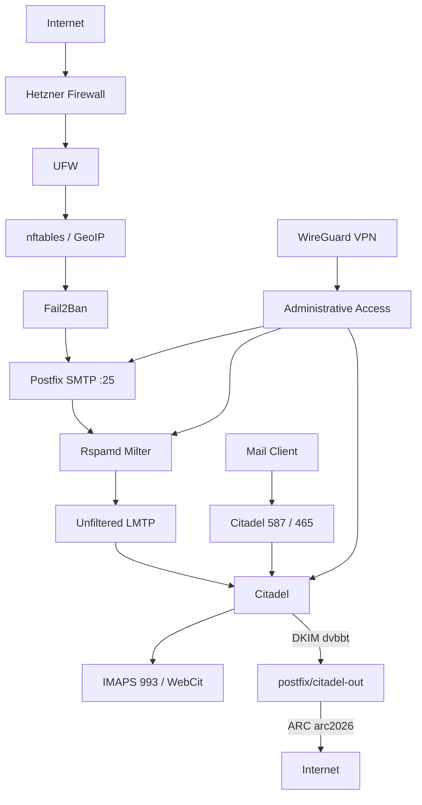

```mermaid
flowchart TD

A[Internet]
--> B[Hetzner Firewall]
--> C[UFW]
--> D[nftables / GeoIP]
--> E[Fail2Ban]

E --> F[Postfix SMTP :25]

F --> G[Rspamd Milter]

G --> H[Unfiltered LMTP]

H --> I[Citadel]

I --> J[IMAPS 993 / WebCit]

K[Mail Client]
--> S[Citadel 587 / 465]

S --> I

I -->|DKIM dvbbt| O[postfix/citadel-out]

O -->|ARC arc2026| N[Internet]

W[WireGuard VPN]
--> L[Administrative Access]

L --> I
L --> G
L --> F
```
