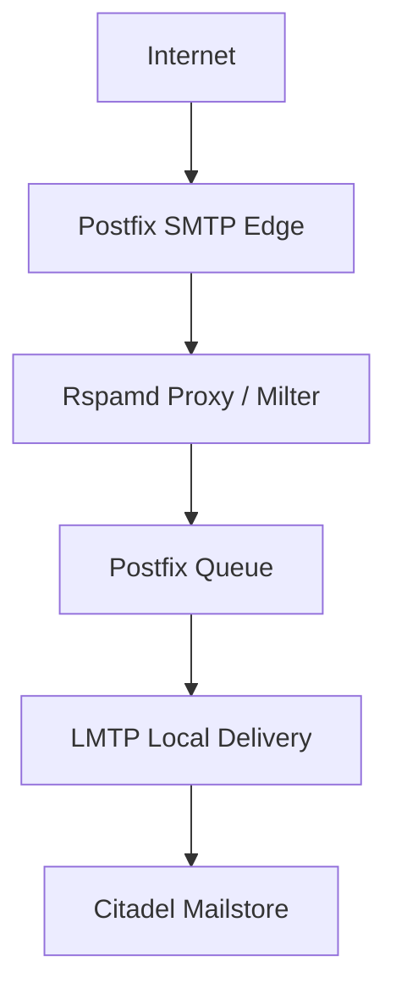

# Rspamd Integration

## Overview

This platform uses Rspamd as the central mail filtering and policy engine.

Rspamd is deeply integrated into the mail flow and operates as a modern high-performance filtering layer between Postfix and Citadel LMTP delivery.

The integration provides:

- Spam filtering
- DKIM signing and verification
- SPF validation
- DMARC enforcement
- ARC signing
- Bayesian learning
- Fuzzy hashing
- URL reputation checks
- MIME and attachment inspection
- Greylisting
- Rate limiting
- Reputation analysis
- DNSBL / SURBL checks
- Custom Lua-based extensions

The entire stack is deployed natively on Linux without containers.

---

# Architecture



Rspamd operates as a Milter-compatible filtering layer and analyzes messages before final LMTP delivery into Citadel.

This architecture separates:

- SMTP transport
- message filtering
- queue handling
- local mailbox delivery

into clearly isolated layers.

---

# Proxy Worker Integration

Rspamd is deployed using the proxy worker architecture.

```ucl
worker {
    rspamd_proxy {
        bind_socket = "localhost:11332";
        milter = true;
    }
}
```

The proxy worker integrates directly with Postfix using the Milter protocol.

Benefits:

- asynchronous filtering
- high throughput
- queue separation
- low latency
- scalable architecture

---

# Redis Backend

Redis is used as the central backend for multiple Rspamd components.

Features using Redis include:

- history storage
- fuzzy hashes
- Bayesian statistics
- neural learning
- reputation systems
- greylisting

This allows fast lookups and efficient memory usage while keeping the filtering pipeline lightweight.

---

# Message Authentication

The platform implements modern mail authentication standards.

## SPF

SPF validation is enabled to verify sender authorization.

## DKIM

Rspamd performs DKIM verification and DKIM signing.

## DMARC

DMARC policies are enforced to reduce spoofing and phishing attacks.

## ARC

ARC signing is enabled for forwarded mail authentication preservation.

```ucl
arc {
    sign_inbound = true;
    use_domain = "recipient";
}
```

This improves trust handling for forwarded or relayed messages.

---

# Advanced Filtering

Rspamd is configured with extensive filtering capabilities.

## Reputation Systems

The platform uses:

- Spamhaus
- SURBL
- URIBL
- DNSWL
- Senderscore
- Spameatingmonkey

for sender and URL reputation analysis.

## Bayesian Learning

Bayesian filtering continuously improves spam detection quality.

## Fuzzy Hashing

Rspamd fuzzy storage is enabled using Redis backend support.

## Greylisting

Greylisting is enabled for unknown senders.

```ucl
greylist {
    action = "soft reject";
    timeout = 300;
}
```

## MIME and Attachment Inspection

Rspamd inspects:

- Office documents
- PDF files
- archive files
- MIME anomalies
- obfuscated attachments

to detect malicious content and phishing attempts.

---

# Custom Lua Extensions

The platform includes custom Lua-based Rspamd modules.

## motobike_arf

```ucl
motobike_arf {
    enabled = true;
}
```

This custom module extends abuse handling and automated filtering capabilities.

The integration demonstrates the flexibility of Rspamd and the ability to extend filtering behavior beyond standard installations.

---

# Administrative Security

Rspamd administrative interfaces are not publicly exposed.

The controller worker is bound only to localhost.

```ucl
bind_socket = "localhost:11334";
secure_ip = "127.0.0.1";
```

Administrative access is available only through:

- SSH
- WireGuard VPN

This reduces the attack surface significantly.

---

# Native Linux Deployment Philosophy

The entire platform is deployed natively on Linux without Docker or container orchestration.

Benefits include:

- lower resource consumption
- direct system visibility
- simplified troubleshooting
- reduced abstraction layers
- improved long-term maintainability
- deeper understanding of system internals

This design follows classic Unix principles:

- modularity
- transparency
- service separation
- local socket communication
- minimal overhead

---

# Conclusion

Rspamd forms the central security and filtering component of the Modern Citadel Mail Platform.

Combined with:

- Postfix
- LMTP
- Citadel
- Redis
- WireGuard
- Fail2Ban
- nftables

the result is a lightweight but highly capable native Linux mail platform focused on:

- security
- transparency
- efficiency
- maintainability
- independence from cloud ecosystems
- deep system integration
