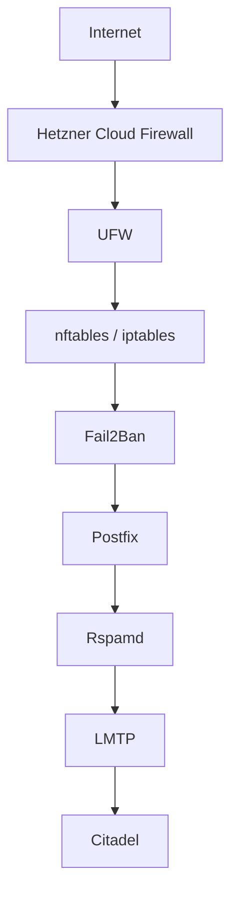

# Security Stack

## Overview

The Modern Citadel Mail Platform uses a layered Unix-style security architecture.

Instead of relying on a single monolithic security appliance, the platform combines multiple independent security layers:

- Hetzner Cloud Firewall
- UFW
- nftables
- Fail2Ban
- WireGuard
- Postfix hardening
- Rspamd filtering
- TLS encryption
- DNS-based authentication technologies

This creates a defense-in-depth architecture with clear separation of responsibilities.

---

# Security Architecture



---

# Hetzner Cloud Firewall

The first external security layer is provided by the Hetzner Cloud Firewall.

Only required public services are exposed:

| Port | Service |
|---|---|
| 25 | SMTP |
| 80 | HTTP / ACME |
| 443 | HTTPS |
| 465 | SMTPS |
| 587 | SMTP Submission |
| 993 | IMAPS |
| 51820/UDP | WireGuard |
| ICMP | Diagnostics |

All other traffic is blocked at the infrastructure edge.

IPv4 and IPv6 filtering are both enabled.

---

# UFW

UFW provides host-level firewall management.

The UFW configuration mirrors the externally exposed Hetzner firewall ports while allowing local service communication internally.

Responsibilities:

- host-level access control
- local service filtering
- interface separation
- additional protection layer after Hetzner edge filtering

---

# nftables / iptables

The platform uses nftables with iptables-nft compatibility.

nftables handles:

- packet filtering
- Fail2Ban integration
- permanent blocklists
- VPN forwarding
- connection filtering

The ruleset is intentionally kept transparent and maintainable.

---

# Fail2Ban

Fail2Ban provides automatic intrusion response and abuse mitigation.

Active jails:

- citadel-msasubmission
- postfix-msasubmission
- postfix-smtp
- smtp-citadel
- smtp-submission
- sshd
- webcit
- perma-ban

This protects against:

- SMTP abuse
- brute-force attacks
- credential guessing
- web interface abuse
- automated scanners

---

# Permanent Ban Lists

The platform additionally maintains permanent blocklists for known abusive systems.

This reduces repeated attack traffic and lowers unnecessary processing load.

---

# WireGuard Administrative Isolation

Administrative access is isolated through WireGuard VPN.


WireGuard network:

```text
10.*.*.*/24
```

Administrative services are intentionally not publicly exposed.

Examples:

- Rspamd WebUI
- internal management interfaces
- local service administration
- SSH management workflows

This significantly reduces exposed attack surface.

---

# Postfix Hardening

Postfix acts as the public SMTP edge service.

Security features include:

- relay restrictions
- recipient validation
- sender validation
- SMTP rate limiting
- queue separation
- TLS enforcement
- controlled submission handling

Postfix is intentionally separated from mailbox handling responsibilities.

---

# LMTP Local Delivery

Internal mail delivery uses LMTP over Unix domain sockets.


Advantages:

- local-only delivery
- reduced internal SMTP exposure
- cleaner service separation
- direct mailbox delivery semantics

The previous internal SMTP transport on port 2025 is no longer required for local delivery operations.

---

# Rspamd Security Layer

Rspamd provides advanced mail filtering and message authentication.

Features include:

- DKIM signing
- ARC signing
- spam scoring
- DNSBL checks
- reputation analysis
- policy enforcement
- Redis integration
- Lua scripting support

Rspamd is integrated using Postfix milters.

---

# Modern Mail Security Standards

The platform supports modern email security technologies:

- SPF
- DKIM
- DMARC
- ARC
- DNSSEC
- DANE/TLSA
- TLSv1.2
- TLSv1.3

This improves:

- sender authenticity
- transport security
- anti-spoofing protection
- SMTP trust validation

---

# Unix Security Philosophy

The security architecture intentionally follows classic Unix principles:

- multiple small security layers
- minimal public exposure
- local-only administrative services
- native Linux integration
- transparent configurations
- operational simplicity

The goal is not complexity.

The goal is visibility, maintainability and reliable long-term operation.

---

# Operational Philosophy

The platform avoids dependency on:

- Docker
- Kubernetes
- external SaaS platforms
- proprietary mail appliances
- hosted groupware ecosystems

Instead, the system focuses on:

- native Linux services
- transparent administration
- local data ownership
- hardware efficiency
- long-term maintainability
- educational value through direct system understanding

This allows the platform to run efficiently even on small systems such as:

- Raspberry Pi
- low-power x86 servers
- RISC-V systems
- lightweight virtual machines

while still supporting modern mail security standards.
